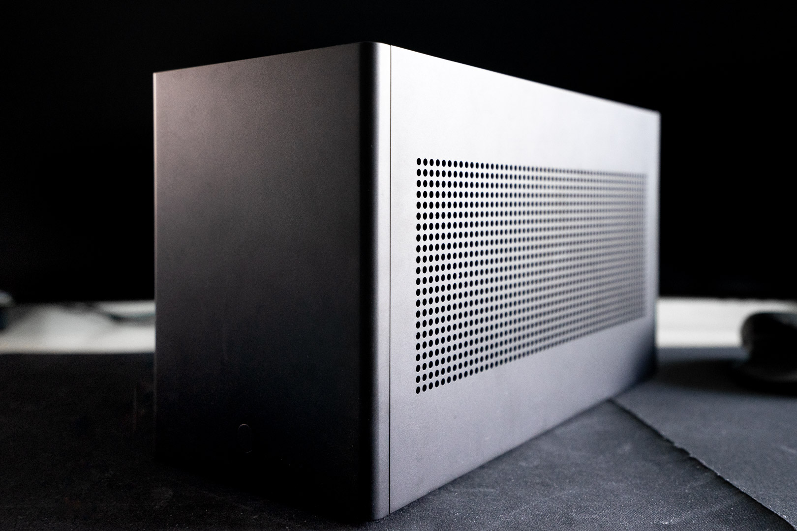
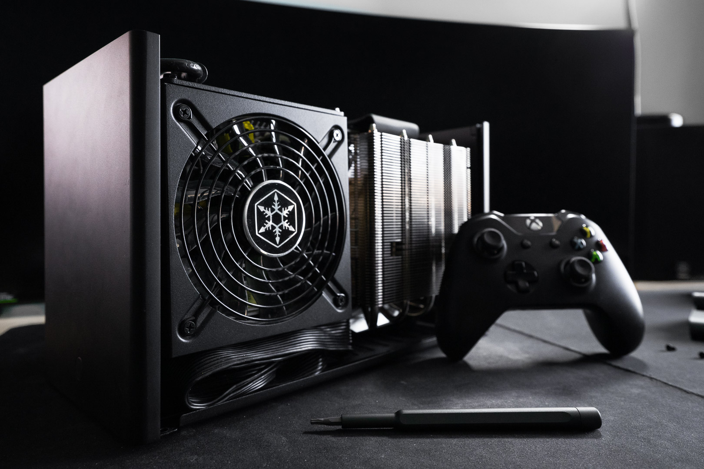
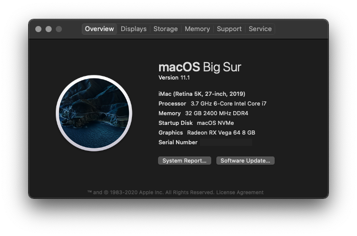

# Hackintosh
## Getting Started

This repository is tested and working with OpenCore 0.6.4 and macOS Mojave 10.14.6. In order to use my `config.plist`, you must provide your own serial numbers as described in the OpenCore installation guide. 

## Components

| Parts List    | 
| ------------- | 
| Intel i7 8700K |
| ASUS Strix Z370-I | 
| 32 GB G.Skill Trident Z |
| XFX Vega 64 Reference |
| Dell M.2 DW 1650 Wireless AC/BT Card |
| Ghost S1 - Ash |
| Noctua NH-L12 |
| Corsair SF750 |

---
## Gallery

---
